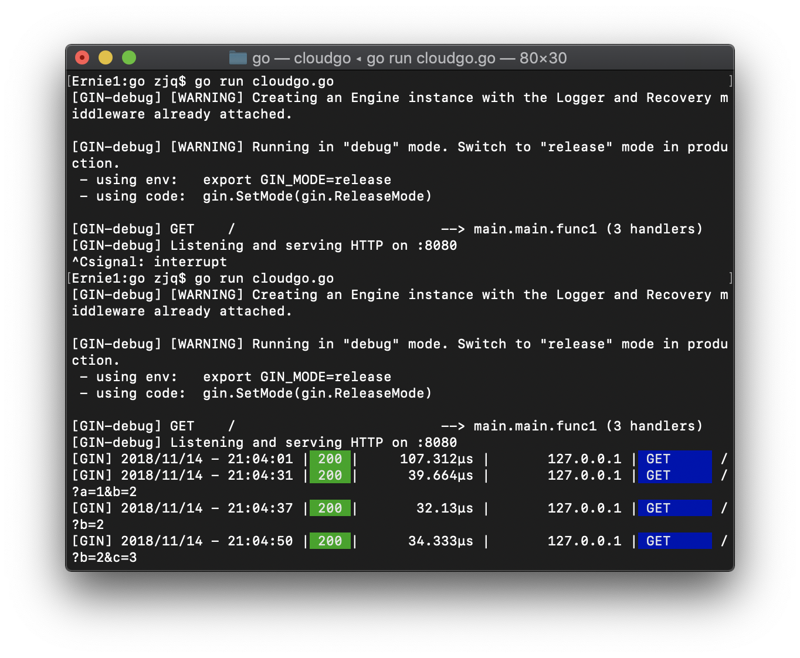

# A Web Services Program Similar to Cloudgo Application
## Select [Gin Web Framework](https://github.com/gin-gonic/gin)
Gin is a web framework written in Go (Golang). It features a martini-like API with much better performance, up to 40 times faster thanks to httprouter.
## Curl Testing
### Client
```bash
Ernie1:go zjq$ curl "localhost:8080"
Hello Default
Ernie1:go zjq$ curl "localhost:8080?a=1&b=2"
Hello 1 2
Ernie1:go zjq$ curl "localhost:8080?b=2"
Hello Default 2
Ernie1:go zjq$ curl "localhost:8080?b=2&c=3"
Hello Default 2
```
### Server

## [Ab](https://httpd.apache.org/docs/2.4/programs/ab.html) Testing
total 1000 requests to perform, 100 requests to perform at a time
```
Ernie1:go zjq$ ab -n 1000 -c 100 "http://localhost:8080/?a=1&b=2"
This is ApacheBench, Version 2.3 <$Revision: 1826891 $>
Copyright 1996 Adam Twiss, Zeus Technology Ltd, http://www.zeustech.net/
Licensed to The Apache Software Foundation, http://www.apache.org/

Benchmarking localhost (be patient)
Completed 100 requests
Completed 200 requests
Completed 300 requests
Completed 400 requests
Completed 500 requests
Completed 600 requests
Completed 700 requests
Completed 800 requests
Completed 900 requests
Completed 1000 requests
Finished 1000 requests


Server Software:        
Server Hostname:        localhost
Server Port:            8080

Document Path:          /?a=1&b=2
Document Length:        10 bytes

Concurrency Level:      100
Time taken for tests:   0.063 seconds
Complete requests:      1000
Failed requests:        0
Total transferred:      127000 bytes
HTML transferred:       10000 bytes
Requests per second:    15760.94 [#/sec] (mean)
Time per request:       6.345 [ms] (mean)
Time per request:       0.063 [ms] (mean, across all concurrent requests)
Transfer rate:          1954.73 [Kbytes/sec] received

Connection Times (ms)
              min  mean[+/-sd] median   max
Connect:        0    2   0.6      3       4
Processing:     1    3   0.9      3       7
Waiting:        0    3   0.8      3       6
Total:          3    6   0.8      6      10
WARNING: The median and mean for the initial connection time are not within a normal deviation
        These results are probably not that reliable.

Percentage of the requests served within a certain time (ms)
  50%      6
  66%      6
  75%      6
  80%      7
  90%      7
  95%      7
  98%      8
  99%      8
 100%     10 (longest request)
 ```

**Server Software**  
The value, if any, returned in the server HTTP header of the first successful response. This includes all characters in the header from beginning to the point a character with decimal value of 32 (most notably: a space or CR/LF) is detected.  

**Server Hostname**  
The DNS or IP address given on the command line  

**Server Port**  
The port to which ab is connecting. If no port is given on the command line, this will default to 80 for http and 443 for https.  

**Document Path**  
The request URI parsed from the command line string.  

**Document Length**  
This is the size in bytes of the first successfully returned document. If the document length changes during testing, the response is considered an error.  

**Concurrency Level**  
The number of concurrent clients used during the test  

**Time taken for tests**  
This is the time taken from the moment the first socket connection is created to the moment the last response is received  

**Complete requests**  
The number of successful responses received  

**Failed requests**  
The number of requests that were considered a failure. If the number is greater than zero, another line will be printed showing the number of requests that failed due to connecting, reading, incorrect content length, or exceptions.  

**Write errors**  
The number of errors that failed during write (broken pipe).  

**Total transferred**  
The total number of bytes received from the server. This number is essentially the number of bytes sent over the wire.  

**HTML transferred**  
The total number of document bytes received from the server. This number excludes bytes received in HTTP headers  

**Requests per second**  
This is the number of requests per second. This value is the result of dividing the number of requests by the total time taken  

**Time per request**  
The average time spent per request. The first value is calculated with the formula concurrency * timetaken * 1000 / done while the second value is calculated with the formula timetaken * 1000 / done  

**Transfer rate**  
The rate of transfer as calculated by the formula totalread / 1024 / timetaken